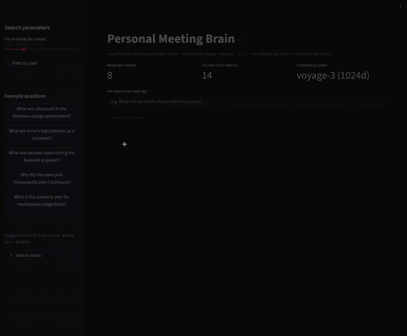
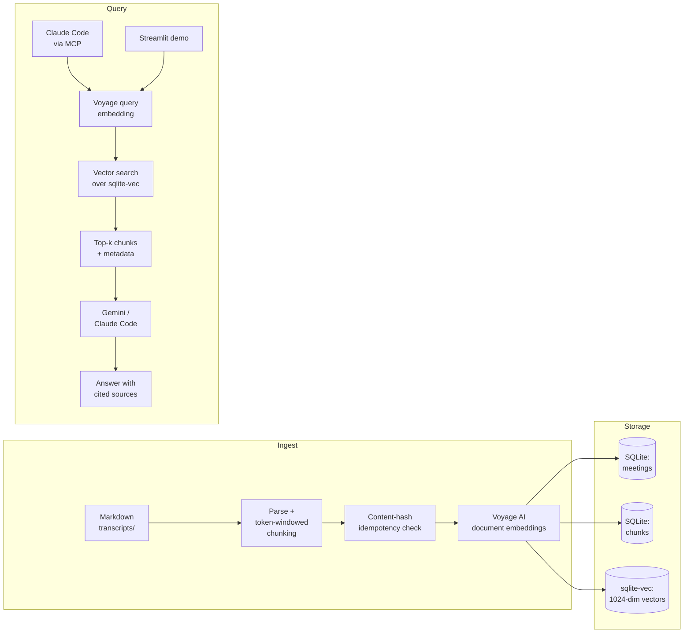

# Personal Meeting Brain

> Local RAG over your meeting transcripts. Runs entirely on your laptop. Exposed to Claude Code as an MCP server, with an optional web demo.


<!-- TODO: replace with a 15–25s GIF showing a query in Claude Code → MCP tool call → answer with citations. Save as demo/claude-mcp-demo.gif -->


---

## Why I built this

I run 5–10 standups and technical calls a week. Two weeks later I can't remember what we decided about rate limits, which blocker Andrey mentioned twice, or what I promised to ship by Friday. Existing meeting tools record everything beautifully — and then forget it across meetings.

So I built a small, local, no-SaaS system that does one thing well: **answer questions across all of my transcripts**, with citations, from inside the tool I already use to think (Claude Code).

It's a pet project. But the engineering choices are the same ones I'd make in production.

---

## What it does

Drop your meeting transcripts into a folder as Markdown files. The system:

1. **Ingests and chunks** them (token-windowed, content-hash idempotent — re-running is safe).
2. **Embeds** each chunk with Voyage AI's `voyage-3` (1024-dim, multilingual, asymmetric query/document encoding).
3. **Stores** vectors and metadata in a single SQLite file (`sqlite-vec` for ANN search).
4. **Exposes** four tools over [MCP](https://modelcontextprotocol.io): `search_meetings`, `get_meeting`, `list_meetings`, `reindex`.
5. **Plugs into Claude Code** so you can ask "What did we decide about domain check limits?" in the same window where you write code.

A self-contained Streamlit + Gemini demo is included for showing the retrieval loop to people who don't have Claude Code installed.

---

## Quick start

```bash
git clone https://github.com/dagryazev/personal-meeting-brain
cd personal-meeting-brain
uv sync
cp .env.example .env
# add VOYAGE_API_KEY (free tier is enough) and GEMINI_API_KEY (for the demo)

# Drop your *.md transcripts into transcripts/ (filename like 2024-08-15_team-sync.md)
uv run meeting-brain-ingest

# Option A — register as an MCP server in Claude Code
claude mcp add meeting-brain -- uv --directory $(pwd) run meeting-brain-mcp

# Option B — run the web demo locally
uv run streamlit run demo/app.py
```

That's it. Ask Claude Code: *"What did we discuss about the search ranker last week?"*

---

## Try it live

A public demo runs on Railway with 8 fictional transcripts (made-up startup, invented people):

**[personal-meeting-brain-production.up.railway.app](https://personal-meeting-brain-production.up.railway.app/)**

The demo is intentionally minimal — Streamlit, no auth, public dataset. The **real** interface is the MCP server inside Claude Code; the web app exists so you can see the retrieval loop end-to-end without installing anything.

<!-- TODO: replace with a 20s GIF of the Streamlit demo answering a question with sources expanded. Save as demo/streamlit-demo.gif -->


---

## Architecture



Single SQLite file. No external services beyond the embedding and generation APIs. Survives a `scp` to another machine — that was a design goal, not an accident.

---

## Engineering decisions

The interesting parts of this project aren't the LLM calls. They're the trade-offs I made along the way.

### SQLite + `sqlite-vec` instead of Postgres + pgvector

A single-file database for a single-user system is the right answer. No Docker for the DB, no managed service, no migrations to wrangle. The whole index is ~5–20 MB per few hundred meetings — small enough to back up, sync, or rebuild from scratch.

`sqlite-vec` is a recent extension that ships ANN search inside SQLite with no extra processes. For datasets in the thousands of chunks, it's faster to set up than pgvector and indistinguishable in retrieval quality.

*Reconsider when:* multi-user write contention, or chunk counts above ~100k.

### Voyage AI `voyage-3` for embeddings

1024 dimensions, multilingual (my meetings mix English and Russian — most providers degrade noticeably on the second language). Better retrieval on technical/conversational text than `text-embedding-3-small` in my informal evals, at competitive cost.

Free tier is enough for personal use (200M tokens/month at time of writing).

### Asymmetric query/document encoding

Documents are embedded with `input_type="document"` at ingest; queries with `input_type="query"` at search time. Voyage's docs are explicit that this materially improves retrieval — same model, different prefix, noticeably better top-k. It's the kind of detail naive RAG implementations skip and then wonder why their retrieval is mediocre.

### Token-windowed chunking (~512 tokens, 64-token overlap)

Meeting transcripts are conversational and bursty. Fixed-size chunks at 512 tokens with 64-token overlap preserve enough context per chunk to be self-contained, without diluting embeddings across multiple topics.

This is a deliberate v1 simplification. Speaker-aware chunking (grouping by utterance/exchange) is on the roadmap and would likely lift retrieval precision another 5–10%.

### Content-hash idempotent ingest

Each transcript's SHA-256 is stored. Re-running ingest skips unchanged files and re-embeds only edited ones. Safe to run on a cron, on a file watcher, or every time you launch the MCP server. Tiny detail, but it's the difference between "demo script" and "tool I actually use daily."

### MCP exposure as the primary interface

This is the project's biggest bet. Instead of building yet another chat UI, the retrieval lives behind four tools (`search_meetings`, `get_meeting`, `list_meetings`, `reindex`) and one resource (`meetings://index`). Claude Code becomes the front end — full multi-turn reasoning, citations, code generation, all for free.

The Streamlit demo exists for people who can't run Claude Code. It's not the product.

---

## Performance & cost

Measured on the 8 fictional transcripts bundled in this repo (4,618 doc tokens, 14 chunks, `cl100k_base`). 15 hand-written queries in `evals/queries.jsonl`, exercising name lookups, decision recall, action items, conceptual queries, and date-anchored questions.

| Metric                                  | Value          | Notes                                                                                       |
| --------------------------------------- | -------------- | ------------------------------------------------------------------------------------------- |
| Recall@5                                | **1.000**      | 15/15 — small fictional set; with a real corpus expect 0.85–0.95                            |
| MRR@10                                  | **1.000**      | Every expected transcript ranked at position 1                                              |
| Query latency, search-only P50 / P95    | **2.4 / 4.2 ms** | sqlite-vec MATCH + JOIN, query embedding served from local cache; n=60                    |
| Query latency, end-to-end P50 / P95     | **441 / 1302 ms** | Includes Voyage round-trip from EU; n=11 cold runs. Network jitter dominates             |
| Ingest time per meeting (paid tier)     | **~1.2 s**     | Parse + chunk + Voyage doc embed + SQLite write. Free-tier 3 RPM forces ~75s waits         |
| Cost per query, MCP via Claude Code     | **~$1.2 × 10⁻⁶** | Voyage query embed only (~20 tokens); generation runs in Claude Code, no extra fee        |
| Cost per query, Streamlit demo          | **~$1.5 × 10⁻³** | Voyage embed + Gemini 2.5 Flash on top-5 chunks (~3K input / ~250 output)                 |
| Cost per ingested meeting               | **~$3.5 × 10⁻⁵** | ~577 doc tokens × Voyage `voyage-3` rate. 100 meetings ≈ $0.0035                          |
| Index size, current (8 meetings)        | **4.12 MB**    | SQLite file; `vec0` reserves storage in chunked blocks, so per-meeting size is non-linear   |
| Index size, projected (100 meetings)    | **~10–15 MB**  | Dominated by 1024-dim float32 vectors (~4 KB each) + chunk text; not a simple 100/8 scaling |

Prices used: Voyage `voyage-3` $0.06 / 1M tokens; Gemini 2.5 Flash $0.30 / 1M input, $2.50 / 1M output (paid tier, May 2026).

Reproduce with:

```bash
uv run python evals/run_evals.py            # full eval — uses ./evals/_query_embed_cache.json
uv run python evals/run_evals.py --no-cache # fresh end-to-end timing (requires headroom against Voyage rate limits)
```

---

## MCP integration

Once registered with Claude Code, four tools become available:

- **`search_meetings(query, limit=5)`** — semantic search over chunks. Returns ranked excerpts with meeting metadata.
- **`get_meeting(meeting_id | path)`** — fetch the full transcript.
- **`list_meetings(limit=50, offset=0)`** — browse metadata.
- **`reindex(force=False)`** — rescan `transcripts/` for new or edited files.

Plus one resource:

- **`meetings://index`** — a Markdown table of every indexed meeting, suitable for dropping into Claude's context.

Example prompts that work well:

> *"What did we decide about the domain-check rate limits?"*
> *"Pull up the full transcript of the team sync on Aug 15."*
> *"List my meetings from this month and summarise what each one was about."*
> *"Reindex the transcripts folder — I just added two new files."*

---

## Project structure

```
personal-meeting-brain/
├── src/meeting_brain/      # ingestion, embeddings, search, MCP server
├── demo/                   # Streamlit app + Dockerfile bits + screenshots
├── transcripts/            # your *.md files go here (or use the bundled fictional ones)
├── data/                   # SQLite database (gitignored)
├── tests/                  # pytest suite
├── .mcp.json               # project-scoped MCP config for Claude Code
├── Dockerfile              # multi-stage, uv-based, deploys cleanly to Railway
├── railway.toml            # Railway service configuration
└── pyproject.toml          # uv-managed dependencies
```

---

## Data schema

Three tables, defined in [`src/meeting_brain/db.py`](src/meeting_brain/db.py):

- **`meetings`** — one row per source file. `id`, `path`, `title`, `meeting_date`, `raw_text`, `content_hash`, `ingested_at`.
- **`chunks`** — token-windowed chunks. `id`, `meeting_id`, `chunk_index`, `text`, `start_token`, `end_token`.
- **`vec_chunks`** — `sqlite-vec` virtual table, `1024-dim` float vectors keyed on `chunks.id`.

---

## Roadmap

This is a pet project, but it's actively used. Things on the bench:

- **Hybrid search** (BM25 via SQLite FTS5 + dense vectors with reciprocal rank fusion). Personal meetings are full of names and technical acronyms that pure semantic search loses.
- **Speaker-aware chunking** instead of fixed-size windows.
- **Action item & decision extraction** as a separate pass, stored in their own table and exposed as MCP tools (`find_decisions`, `list_action_items`).
- **People aggregation** — auto-build per-person summaries that update after each new meeting, for pre-meeting briefings.
- **Focus tracking** — surface "what I've been spending my brain on lately" across the last N standups.
- **Direct ClickUp ingest** as an alternative to the Markdown folder, since that's where my real transcripts live.

Not on the roadmap: turning this into a SaaS, joining your meetings as a bot, or anything that ships my conversations to a server I don't own.

---

## Local-first, by design

- No data leaves your machine except embedding API calls (Voyage) and generation API calls (Gemini, optional).
- The full index is a single SQLite file. Back it up by copying one file. Sync between machines by `scp`.
- The MCP server runs locally; Claude Code talks to it over stdio.
- The Streamlit demo on Railway exists only for the public showcase with fictional data.

---

## License

MIT. Do whatever you want with the code. The bundled transcripts are entirely fictional.

---

## Acknowledgments

- [`sqlite-vec`](https://github.com/asg017/sqlite-vec) by Alex Garcia — the quiet workhorse of this project.
- [Voyage AI](https://www.voyageai.com/) for `voyage-3` and the asymmetric encoding API.
- [Anthropic's MCP](https://modelcontextprotocol.io) for making "tool" a first-class citizen in Claude Code.